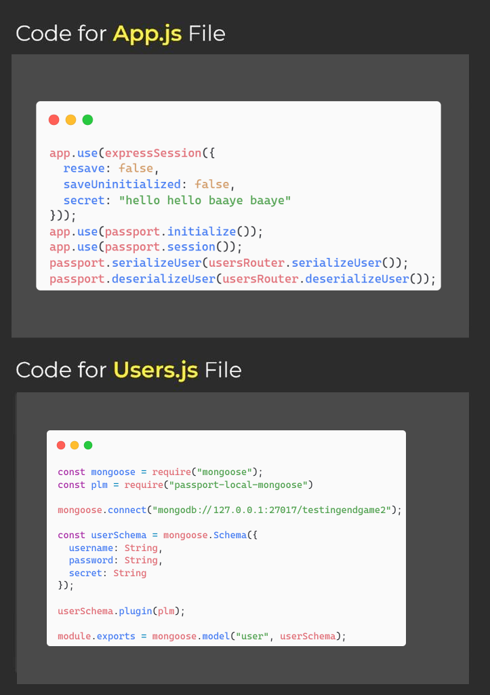

# Backend EndGAME 2 containing Flash, MongoDB usage, Authentication and Authoriazation
## Flash
- used for warnign usen in website
- install 
connect-flash
- make setup express session
- make sure you connect flash in app.use function
- kisi bhi route mei flash create karna haai
## MongoDB usage
- findall
- findone -- incase-sensitiv
- find using category
- date type searching
- findexist if exist or not
- findall -- on specific length
## Authentication and Authoriazation
### steps

- then
  

### learned here
- profile
- register
- login
- logout
- is logged out check..